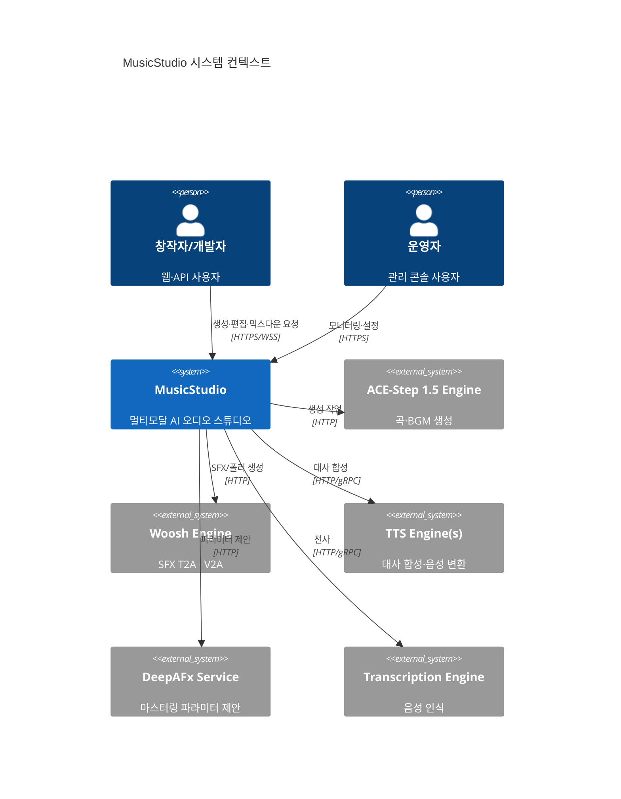
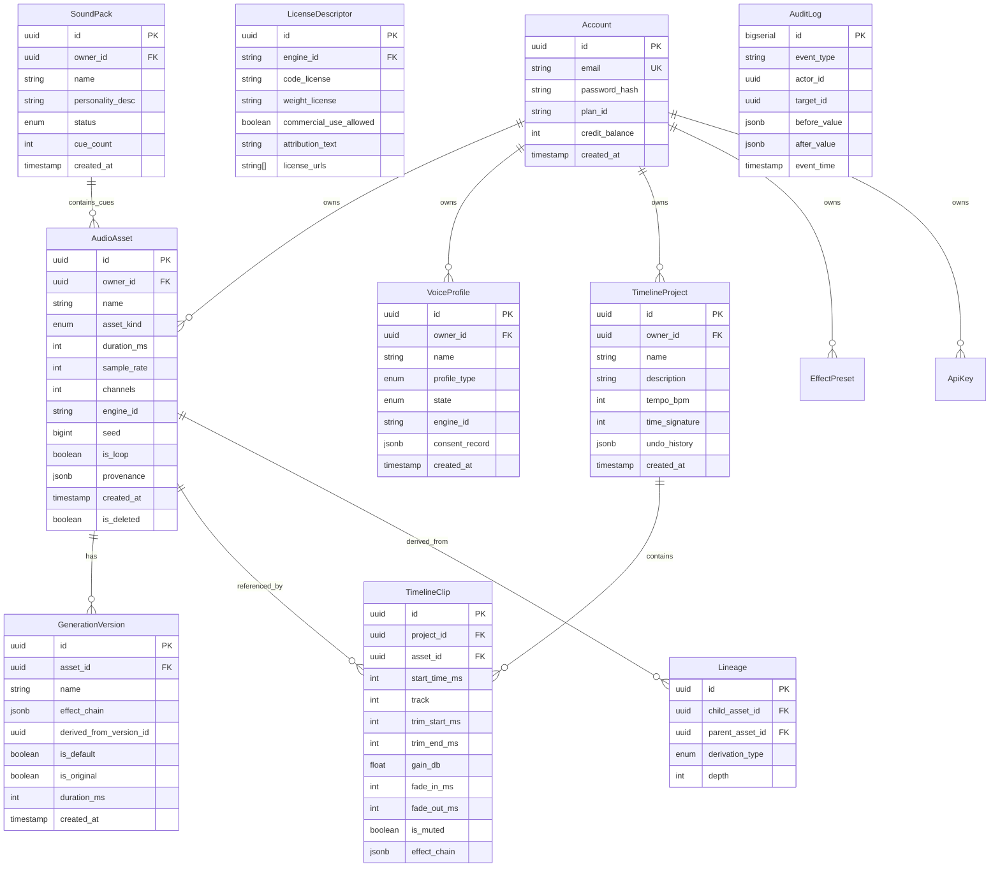
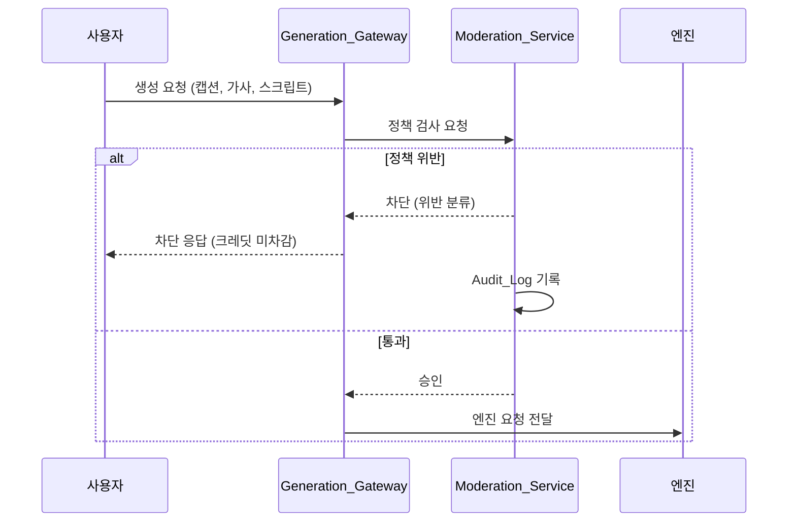
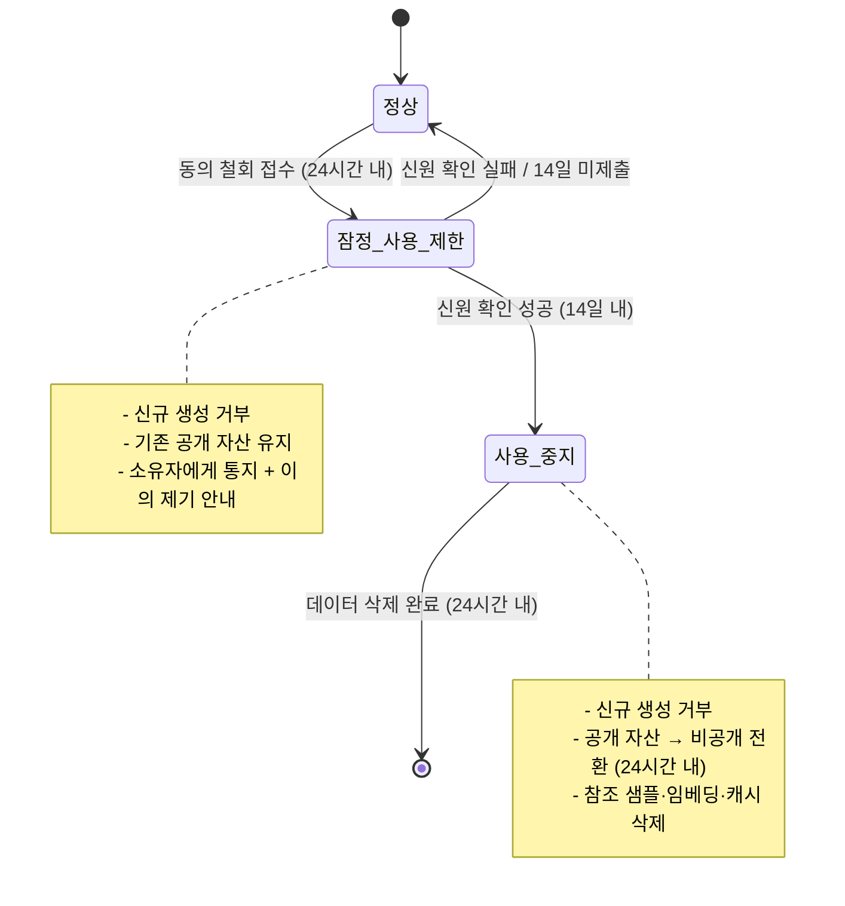

# 기술 설계 문서 — 멀티모달 AI 오디오 스튜디오 (MusicStudio)

## 1. 개요 및 범위

### 1.1 목적

본 설계는 ACE-Step 1.5 생성 엔진 위에 **곡(song) · 배경음악(BGM) · 효과음(SFX) · 대사(dialogue)** 를 하나의 제품 표면에서 생성·편집·믹싱하여 완성 오디오로 내보내는 멀티모달 AI 오디오 스튜디오의 기술 구조를 정의한다.

### 1.2 핵심 설계 원칙

| 원칙 | 설명 |
|------|------|
| **엔진 투명성** | 생성 엔진은 교체 가능한 어댑터 뒤에 숨긴다. 제품 계층은 엔진 내부를 알지 못한다. |
| **비파괴 편집** | 원본 오디오는 절대 변경되지 않는다. 모든 가공은 새 버전으로 남긴다. |
| **결정적 재현** | 동일 입력·동일 파라미터로 동일 출력을 보장한다(비트 단위 재현). |
| **상업 라이선스 전파** | 계보 DAG를 따라 비상업 라이선스가 자동 전파되고 우회 불가하다. |
| **접근성 우선 모션** | 모든 애니메이션은 상태 전달/장식으로 분류되며 `prefers-reduced-motion`을 존중한다. |

### 1.3 범위 경계

- **포함**: 계정, 크레딧, 생성(곡·BGM·SFX·대사), 편집, 타임라인, 믹스다운, 이펙트, 마스터링, 라이브러리, 재생, 공유, 페르소나, 음성 복제·동의·철회, 전사, UI 사운드, 디자인 시스템, 라이선스 준수, 품질 임계값 관리, 개발자 API, 운영 모니터링
- **제외**: 결제 게이트웨이 내부, 영상 편집, 악보 편집, 소셜 DM

### 1.4 저장소 및 배포 경계

#### 1.4.1 제품 계층은 독립 서비스다

§1은 ACE-Step을 **외부 서비스**로 규정한다(§2.1의 `System_Ext`). 따라서 제품 계층(MusicStudio)은 ACE-Step 엔진과 **별도의 배포 단위이자 별도의 저장소로 최종 분리되는 것을 전제**한다.

현재는 전환 비용을 줄이기 위해 `ACE-Step-1.5` 저장소의 `musicstudio/` 디렉터리에 **자체 완결적(self-contained) 서비스로 스캐폴드**한다. 이후 `git filter-repo`로 이력을 보존한 채 독립 저장소로 추출한다. 이 전제 때문에 `musicstudio/`는 처음부터 상위 저장소의 빌드·의존성·테스트 체계에 의존하지 않도록 설계되어야 한다.

#### 1.4.2 `musicstudio/`는 자체 도구 체계를 갖는다

| 대상 | 방침 |
|------|------|
| `musicstudio/package.json` | 신규 생성. 제품 계층 Node/TypeScript 의존성 선언 |
| `musicstudio/tsconfig.json` | 신규 생성. 제품 계층 전용 컴파일러 설정 |
| `musicstudio/` 테스트 하네스 | 자체 보유. `fast-check`(TypeScript PBT) |
| `musicstudio/dsp/pyproject.toml` | 신규 생성. DSP worker 의존성(`hypothesis`, pedalboard, librosa, pyloudnorm 등)을 독립 선언 |
| **저장소 루트 `package.json`** | **변경하지 않는다.** VitePress 문서 전용 |
| **저장소 루트 `pyproject.toml`** | **변경하지 않는다.** ACE-Step 엔진 의존성 전용 |

DSP worker 의존성을 루트 `pyproject.toml`에 추가하지 않는 이유는, 엔진의 PyTorch/CUDA 의존성 해석과 제품 계층 DSP 의존성 해석을 분리하여 어느 한쪽의 버전 제약이 다른 쪽을 오염시키지 않게 하기 위함이다. 두 Python 환경은 독립적으로 해석·설치된다.

#### 1.4.3 규약 적용 경계

저장소 루트의 `AGENTS.md`가 정의하는 규약은 **`acestep/` 이하 엔진 코드에 적용된다**.

| 규약(`AGENTS.md`) | `acestep/` | `musicstudio/` |
|-------------------|-----------|----------------|
| unittest 스타일 테스트 | 적용 | 미적용 — §10 전략(`fast-check` / `hypothesis`) 사용 |
| `*_test.py` 명명 | 적용 | 미적용 — §12 스택의 관례 사용 |
| 모듈 150 LOC 권장 / 200 LOC 상한 | 적용 | **원칙으로 적용** (§1.4.3 하단 참조) |
| Python 3.11–3.12 | 적용 | DSP worker에만 관련. `musicstudio/dsp/pyproject.toml`이 독립 선언 |
| loguru 로깅 | 적용 | 미적용 — §11.2의 구조화 로그 필드 규격 사용 |

`musicstudio/` 이하 제품 계층은 §10에 정의된 자체 테스트 전략과 §12의 스택을 따른다. 단 다음 두 원칙은 `musicstudio/`에도 **동일하게 적용한다**:

- **단일 책임 모듈 유지와 모듈 크기 억제** — 언어별 관용 LOC는 다를 수 있으나, 책임이 하나를 넘으면 분리한다.
- **모든 동작 변경에 대응하는 테스트 추가** — 동작을 바꾸는 변경은 그 동작을 고정하는 테스트를 동반한다.

#### 1.4.4 결합 불변식 (Coupling Invariant)

> **불변식**: `musicstudio/` 이하 코드는 `acestep/` 내부 모듈을 직접 import하지 않는다. ACE-Step과의 유일한 결합점은 `ACE_Engine_Adapter`(§3.1, §3.6)가 호출하는 **HTTP 인터페이스**다.

이 불변식은 §1.2의 **엔진 투명성** 원칙을 저장소 수준에서 기계적으로 강제한 형태이며, §1.4.1의 독립 저장소 추출을 가능하게 하는 전제 조건이다. 위반은 §14 위험 #9로 추적하며, 위반을 CI에서 실패시키는 린트 규칙으로 방어한다.

#### 1.4.5 `musicstudio/` 디렉터리 구조

§2.2의 계층·서비스 목록과 §12의 스택 선택에서 직접 도출한 최상위 형태다.

```
musicstudio/
├── package.json                # 제품 계층 Node 의존성 (루트와 독립)
├── tsconfig.json               # 제품 계층 TS 설정
├── api/                        # API 게이트웨이 계층 (Fastify)
│   ├── gateway/                #   API Gateway / Auth Middleware
│   ├── public/                 #   Public_API (Req 17, Rate Limit)
│   └── sse/                    #   진행 상태 스트리밍 (§2.3)
├── services/                   # 도메인 서비스 계층 (§2.2)
│   ├── account/                #   Account_Service
│   ├── credit/                 #   Credit_Service
│   ├── generation/             #   Generation_Gateway, Job_Orchestrator
│   ├── library/                #   Library_Service, Playback_Service, Sharing_Service
│   ├── persona/                #   Persona_Service
│   ├── speech/                 #   Speech_Service, Voice_Service, Transcription_Service
│   ├── sound/                  #   BGM_Service, SFX_Service, V2A_Service, Sound_Pack_Service
│   ├── timeline/               #   Timeline_Service, Mixdown_Renderer
│   ├── effects/                #   Effects_Service, Mastering_Assistant
│   └── moderation/             #   Moderation_Service
├── adapters/                   # 엔진 어댑터 계층 (§3.1) — 유일한 외부 엔진 결합점
│   ├── registry/               #   Provider_Registry, Engine_Descriptor
│   ├── ace/                    #   ACE_Engine_Adapter (HTTP만; acestep/ import 금지)
│   ├── woosh/                  #   Woosh_Adapter
│   ├── tts/                    #   TTS_Adapter
│   ├── deepafx/                #   DeepAFx_Adapter
│   └── transcription/          #   Transcription_Adapter
├── domain/                     # 파서/프린터·데이터 모델 (§4, §7) — 순수 로직, PBT 주 대상
├── dsp/                        # Python DSP worker (§5, §12)
│   ├── pyproject.toml          #   DSP 의존성 독립 선언 (루트와 독립)
│   ├── src/                    #   리샘플링·이펙트·라우드니스·온셋·믹스다운 체인
│   └── test/                   #   hypothesis 속성 테스트 + 단위 테스트
├── web/                        # React SPA (§8) + UI_Sound_Layer
├── db/                         # PostgreSQL 마이그레이션 · 스키마 (§4)
└── test/                       # TypeScript 테스트 (§10)
    ├── property/               #   fast-check 속성 테스트 (Property 1..N, 100회 이상)
    ├── unit/                   #   예제 기반 단위 테스트
    └── integration/            #   어댑터 E2E · 엔진 폴백 · 팩 완성도
```

`domain/`은 §7의 파서/프린터와 §4의 데이터 모델처럼 I/O가 없는 순수 로직을 모아 §10의 속성 기반 테스트가 인프라 없이 실행되도록 분리한 계층이다.

---

## 2. 아키텍처

### 2.1 시스템 컨텍스트 다이어그램



### 2.2 내부 아키텍처 (계층 뷰)

```mermaid
graph TB
    subgraph "클라이언트 계층"
        WEB[React SPA + Amicro Motion]
        UISOUND[UI_Sound_Layer]
    end

    subgraph "API 게이트웨이"
        GW[API Gateway / Auth Middleware]
        PUB[Public_API]
    end

    subgraph "도메인 서비스 계층"
        ACC[Account_Service]
        CRED[Credit_Service]
        GEN[Generation_Gateway]
        JOB[Job_Orchestrator]
        LIB[Library_Service]
        PLAY[Playback_Service]
        SHARE[Sharing_Service]
        PERSONA[Persona_Service]
        SPEECH[Speech_Service]
        VOICE[Voice_Service]
        TRANS[Transcription_Service]
        BGM[BGM_Service]
        SFX[SFX_Service]
        V2A[V2A_Service]
        PACK[Sound_Pack_Service]
        TL[Timeline_Service]
        MIX[Mixdown_Renderer]
        EFX[Effects_Service]
        MAST[Mastering_Assistant]
        MOD[Moderation_Service]
    end

    subgraph "엔진 어댑터 계층"
        REG[Provider_Registry]
        ACE_A[ACE_Engine_Adapter]
        WOOSH_A[Woosh_Adapter]
        TTS_A[TTS_Adapter]
        DEEP_A[DeepAFx_Adapter]
        WHISPER_A[Transcription_Adapter]
    end

    subgraph "인프라 계층"
        DB[(PostgreSQL)]
        OBJ[(Object Storage S3)]
        CACHE[(Redis)]
        QUEUE[(Task Queue)]
        AUDIT[(Audit_Log append-only)]
    end

    WEB --> GW
    GW --> ACC & CRED & GEN & LIB & SHARE & TL & EFX & MAST & PUB
    GEN --> REG --> ACE_A & WOOSH_A & TTS_A & DEEP_A & WHISPER_A
    JOB --> QUEUE
    MIX --> OBJ
    LIB --> DB & OBJ
    AUDIT --> DB
```




### 2.3 통신 패턴

| 경로 | 프로토콜 | 패턴 |
|------|----------|------|
| 클라이언트 ↔ API GW | HTTPS + WSS | REST + Server-Sent Events (진행 상태) |
| Job_Orchestrator → 엔진 | HTTP | 비동기 폴링 (5초 간격) |
| 엔진 상태 점검 | HTTP | 60 ± 5초 주기 헬스체크 |
| Mixdown_Renderer | 내부 | 동기 처리 (CPU-bound worker) |
| Audit_Log 기록 | 내부 | 비동기 append-only (PostgreSQL WAL) |

### 2.4 설계 결정 근거

- **PostgreSQL + append-only Audit_Log**: 365일 보관, 변경 불가 감사 요건에 부합. 파티셔닝(월별)으로 쿼리 성능 유지.
- **Redis**: 세션 캐시, 크레딧 잔액 원자 연산, 큐 순번 발행.
- **Object Storage (S3-호환)**: 오디오 파일·영상·팩 압축 파일 저장. CDN 연동으로 스트리밍 지연 최소화.
- **Task Queue (BullMQ on Redis)**: Generation_Job 관리. 우선순위·재시도·지수 백오프 내장.

---

## 3. 엔진 추상화 계층

### 3.1 Engine_Adapter 인터페이스

```typescript
interface EngineAdapter {
  /** 엔진 식별자 */
  readonly engineId: string;

  /** 생성 요청을 엔진 고유 형식으로 변환하여 전송 */
  submit(request: NormalizedGenerationRequest): Promise<EngineJobHandle>;

  /** 작업 상태 조회 (0=진행, 1=성공, 2=실패) */
  poll(handle: EngineJobHandle): Promise<EngineJobStatus>;

  /** 결과 오디오 다운로드 */
  fetchResult(handle: EngineJobHandle): Promise<RawAudioResult[]>;

  /** 상태 점검 (10초 타임아웃) */
  healthCheck(): Promise<HealthCheckResult>;

  /** 작업 취소 (대기 상태에서만) */
  cancel(handle: EngineJobHandle): Promise<void>;
}
```

### 3.2 Engine_Descriptor 스키마

```typescript
interface EngineDescriptor {
  engineId: string;                    // 1~64자
  supportedAssetKinds: AssetKind[];    // 1~6개
  supportedInputModalities: InputModality[]; // text | audio | video, 1~3개
  maxOutputDurationMs: number;         // 1000~3600000
  sampleRate: number;                  // 16000~48000
  executionLocation: 'local' | 'remote';
  license: LicenseDescriptor;
  dailyQuota: { maxRequests: number; maxGpuSeconds: number };
}

type AssetKind = 'song' | 'bgm' | 'sfx' | 'dialogue' | 'stem' | 'mix';
type InputModality = 'text' | 'audio' | 'video';
```

### 3.3 라우팅 및 폴백 전략

1. 사용자가 엔진을 명시 → 해당 엔진의 `supportedAssetKinds` 확인 → 미지원 시 거부.
2. 엔진 미지정 → `Provider_Registry`가 해당 `AssetKind`의 기본 엔진으로 라우팅.
3. 기본 엔진 사용 불가 → 대체 엔진이 지정된 경우 1회 재라우팅.
4. 모든 엔진 사용 불가 → 요청 거부, 크레딧 미차감.


### 3.4 상태 점검 및 쿼터

- 60 ± 5초 간격으로 `healthCheck()` 호출. 응답 대기 10초.
- 최근 100건 점검 이력 24시간 이상 보관.
- 연속 3회 실패 → 사용 불가 상태. 연속 2회 성공 → 사용 가능 복귀.
- 일일 쿼터: 매일 00:00 UTC 초기화. 잔량 < 요청 필요량 → 거부.

### 3.5 응답 정규화

모든 엔진 응답은 다음 정규화 형식으로 변환된다:

```typescript
interface NormalizedGenerationResult {
  assetKind: AssetKind;
  durationMs: number;
  sampleRate: number;       // 항상 48000으로 리샘플링 후 저장
  seed: number | null;      // 엔진이 시드 미제공 시 null → 고정 센티넬 저장
  engineId: string;
  status: 'success' | 'failed';
  audioBuffer: Buffer;
}
```

### 3.6 엔진-AssetKind 매핑 테이블

| AssetKind | 기본 엔진 | 대체 엔진 | 비고 |
|-----------|-----------|-----------|------|
| `song` | ACE-Step 1.5 | — | `task_type`: text2music, cover, repaint, extract, lego, complete |
| `bgm` | ACE-Step 1.5 | — | 인스트루멘털 고정, 루프 후처리 |
| `sfx` | Woosh-Flow / Woosh-DFlow | ACE-Step (fallback) | 고속=DFlow(증류), 고품질=Flow |
| `dialogue` | TTS Engine A | TTS Engine B | 엔진별 지원 언어 상이 |
| `stem` | ACE-Step 1.5 | — | `task_type=extract` |
| `mix` | Mixdown_Renderer (내부) | — | 엔진 호출 없음 |

---

## 4. 데이터 모델

### 4.1 ER 다이어그램




### 4.2 계보 DAG (Lineage)

- **최대 깊이**: 32
- **순환 검출**: 저장 시 DFS로 순환 여부 확인. 순환 발견 시 거부.
- **입력 자산 상한**: 자산당 최대 64개 부모.
- **파생 종류**: `cover | repaint | extract | lego | complete | stem_split | mixdown | effect_apply | voice_convert`

### 4.3 상업적 사용 전파 규칙

```
commercial_use_allowed(asset) =
  asset.provenance.commercial_use_allowed
  AND ∀ ancestor ∈ lineage_ancestors(asset, depth≤32):
    ancestor.provenance.commercial_use_allowed
  AND ∀ engine ∈ engines_used(asset):
    engine.license.commercial_use_allowed
```

이 규칙은 **고정 정책**이며 요금제·운영자 설정·API 키 권한으로 우회 불가하다 (Req 33.22).

### 4.4 감사 로그 (Audit_Log)

- PostgreSQL append-only 테이블, 월별 파티셔닝.
- 최소 보관: 365일.
- 기록 대상: 크레딧 변동, 공개 상태 변경, 삭제, 정책 차단, API 키 발급/폐기, 동의 기록, 라이선스 변경, 엔진 상태 변경.
- 이메일·API 키는 마스킹(`***@domain.com`, `sk-***...last4`).

---

## 5. 오디오 DSP 파이프라인

### 5.1 기본 스펙

| 항목 | 값 | 근거 |
|------|-----|------|
| 샘플레이트 | 48000 Hz | ACE-Step·Woosh 모두 48kHz 출력 |
| 비트 깊이 | 32-bit float (내부) → 24-bit (내보내기 wav/flac) | 처리 정밀도 보장 |
| 채널 | 1(mono) 또는 2(stereo) | 자산별 기록 |
| 라우드니스 측정 | ITU-R BS.1770-4 (K-가중, 400ms 블록, 절대 게이트 -70 LUFS, 상대 게이트 -10 LU) | Req 30.24 |
| 트루 피크 | 4× 오버샘플링 | BS.1770-4 준수 |

### 5.2 리샘플링

- 엔진 출력이 48kHz가 아닌 경우 `libsoxr` (quality=VHQ) 으로 리샘플링.
- 리샘플링 후 길이 오차 ≤ ±10ms (Req 19.5).

### 5.3 루프 이음 연속성 (Loop Seam)

루프 자산 (`is_loop=true`) 저장 시 검증:

1. **RMS 연속**: 채널별 마지막 10ms RMS − 첫 10ms RMS ≤ 1.0 dB
2. **샘플 단차**: |last_sample − first_sample| ≤ max_abs_amplitude × 5%
3. **양 끝 에너지**: 첫/마지막 100ms RMS ≥ 전체 RMS − 6 dB
4. **마디 정합**: `duration_ms ≈ N × (60000 / BPM × time_sig)` where N ∈ [1, 64], 오차 ≤ ±25ms

미충족 시 최대 2회 재생성 (총 3회 시도). 3회 모두 실패 → Job 실패, 크레딧 환급.

### 5.4 온셋 검출 (V2A 폴리 정렬)

- 5ms 프레임 단위 단기 RMS 계산.
- 직전 50ms 평균 RMS 대비 6.0 dB 이상 증가하는 최초 프레임 시작 시각 = 온셋.
- 시각 이벤트 신뢰도 ≥ 0.50인 이벤트의 90% 이상이 ±80ms 내에 온셋 보유해야 함.

### 5.5 이펙트 처리 라이브러리

- **pedalboard** (Spotify, Python/C++): Chorus, Reverb, Delay, Compressor, Gain, HPF, LPF, PitchShift 8종.
- **pyloudnorm**: BS.1770-4 라우드니스 측정·정규화.
- **librosa**: 온셋 검출, 멜 스펙트로그램, MFCC.
- **pydub** (fallback): 포맷 변환.

모든 이펙트 처리는 **결정적**(동일 입력 → 동일 출력). 부동소수점 연산 순서를 고정하기 위해:
- NumPy/SciPy 연산 시 `np.seterr(all='raise')` + 단일 스레드 BLAS.
- pedalboard 호출 시 동일 버전·동일 파라미터 보장.

### 5.6 믹스다운 DSP 체인

```
각 렌더링 대상 클립:
  1. 원본 오디오 로드
  2. trim_start / trim_end 적용 (비파괴 슬라이싱)
  3. (옵션) 클립별 Effect_Chain 적용 → 재생 길이로 잘라냄
  4. 게인 적용
  5. 페이드 인/아웃 적용 (선형 크로스페이드)
  6. start_time_ms 위치에 배치

합산:
  7. 모든 클립 신호 합산 (sample-by-sample addition)
  8. 트랙별 음량·팬 적용
  9. 피크 정규화: max_abs > 1.0 → 감쇠 계수 적용 (목표 0.99~1.0)
  10. 48kHz, 지정 채널 수로 출력
```

---

## 6. 타임라인 및 믹스다운


### 6.1 렌더링 알고리즘

```python
def render_mixdown(project: TimelineProject, params: RenderParams) -> AudioBuffer:
    """결정적 믹스다운 렌더링."""
    # 1. 렌더링 대상 클립 집합 결정
    target_clips = resolve_target_clips(project)  # 솔로/음소거 적용
    if len(target_clips) == 0:
        raise EmptyRenderError()

    # 2. 믹스다운 길이 산출
    end_time = max(clip.start_time_ms + clip.play_duration_ms for clip in target_clips)
    total_samples = ms_to_samples(end_time, params.sample_rate)

    # 3. 출력 버퍼 초기화
    output = np.zeros((params.channels, total_samples), dtype=np.float64)

    # 4. 클립별 처리 및 합산 (순서 무관 → 가환성 보장)
    for clip in sorted(target_clips, key=lambda c: c.id):  # ID 순 정렬로 결정성 보장
        audio = load_and_trim(clip)
        audio = apply_clip_effects(audio, clip.effect_chain)
        audio = truncate_to_play_duration(audio, clip.play_duration_ms)
        audio = apply_gain(audio, clip.gain_db)
        audio = apply_fades(audio, clip.fade_in_ms, clip.fade_out_ms)
        place_at(output, audio, clip.start_time_ms, params.sample_rate)

    # 5. 트랙별 음량·팬 적용
    output = apply_track_volumes_and_pans(output, project.tracks, params)

    # 6. 피크 정규화
    peak = np.max(np.abs(output))
    if peak > 1.0:
        attenuation = 0.995 / peak
        output *= attenuation

    return output.astype(np.float32)
```

### 6.2 렌더링 불변식

| 불변식 | 검증 방법 |
|--------|-----------|
| **가환성**: 클립 추가 순서와 무관하게 동일 결과 | 샘플 차이 절대값 ≤ 0.0001 |
| **재현성**: 동일 입력·파라미터 → 동일 출력 (다른 워커 포함) | 3회 렌더링 결과 비트 동일 |
| **길이 정확도**: 출력 길이 = max(start + play_duration) ± 10ms | |
| **피크 정규화**: 감쇠 시 모든 샘플에 단일 계수 적용 | |

### 6.3 클립 이펙트 잘라냄 (Effect Truncation)

- 딜레이/리버브 포함 이펙트 → 테일 발생 → **클립 재생 길이**에서 잘라냄.
- 잘라냄 이후 신호가 믹스에 합산됨.
- 이펙트 테일은 독립 Generation_Version 저장 시에만 보존 (최대 +10000ms).

### 6.4 되돌리기/다시 실행 (Command Pattern)

```typescript
interface EditCommand {
  type: EditCommandType;
  execute(project: TimelineProject): TimelineProject;
  undo(project: TimelineProject): TimelineProject;
}

type EditCommandType =
  | 'clip_add' | 'clip_move' | 'clip_trim' | 'clip_split'
  | 'clip_duplicate' | 'clip_delete' | 'clip_gain' | 'clip_fade'
  | 'clip_mute' | 'track_volume' | 'track_pan' | 'track_solo';
```

- 최근 100회 이력 보관. 101번째 입력 시 가장 오래된 1건 제거.
- 되돌리기 후 새 조작 → 다시 실행 이력 초기화.
- **왕복 속성**: `execute` → `undo` → `redo` → 원래 상태와 프로젝트 동등 관계.
- **역연산 속성**: `execute` → `undo` → 조작 직전 상태와 프로젝트 동등 관계.

---

## 7. 파서/직렬화기

### 7.1 대상 구조체 및 동등 관계

| 구조체 | Parser | Printer | 왕복(Round-trip) | 멱등(Idempotent) | 동등 관계 |
|--------|--------|---------|------------------|------------------|-----------|
| `Lyrics_Document` | Lyrics_Parser | Lyrics_Printer | ✅ | ✅ | 섹션 순서·종류·행 내용 일치 |
| `Timed_Lyrics` | LRC_Parser | LRC_Printer | ✅ (±10ms) | ✅ | 타임스탬프 ±10ms, 행 텍스트 일치 |
| `Timeline_Project` | Project_Parser | Project_Printer | ✅ | ✅ (바이트 동일) | 프로젝트 동등 관계* |
| `Effect_Chain` | Chain_Parser | Chain_Printer | ✅ | ✅ (바이트 동일) | 체인 동등 관계** |
| `Cue_Pack_Manifest` | Manifest_Parser | Manifest_Printer | ✅ | ✅ | 필드 값 일치 |

*프로젝트 동등 관계: 시각·식별자 정확 일치, 게인·트랙 음량 0.1dB 이내, 팬 0.01 이내. 되돌리기 이력·생성 시각 제외.

**체인 동등 관계: 항목 수 동일, 종류 이름 문자 일치, 파라미터 이름 집합 동일, 수치 값 절대 차이 ≤ 0.000001.


### 7.2 오류 보고 규격

모든 파서는 실패 시 다음 구조를 반환한다:

```typescript
interface ParseError {
  line?: number;           // 위반 줄 번호 (LRC, Lyrics)
  index?: number;          // 위반 배열 인덱스 (Effect_Chain, Manifest)
  field?: string;          // 위반 필드 이름
  violation: string;       // 위반 사유 코드
  expected?: string;       // 허용값 설명
  actual?: string;         // 실제 입력값
}
```

### 7.3 Lyrics_Parser 구현 노트

- 인식 섹션: `Verse`, `Pre-Chorus`, `Chorus`, `Bridge`, `Intro`, `Outro`, `Instrumental`
- 미인식 `[Tag]` → 사용자 정의 섹션으로 보존 + 경고.
- 첫 태그 이전 행 → 종류 미지정 선행 섹션.
- **불변식**: 파싱 결과 전체 행 개수 = 입력 비어있지 않은 비태그 행 개수.

---

## 8. 프런트엔드

### 8.1 기술 스택

| 범주 | 선택 | 버전 하한 | 근거 |
|------|------|-----------|------|
| UI 프레임워크 | React | 19 | Concurrent 렌더링, use() 훅 |
| 스타일링 | Tailwind CSS | 4 | JIT 컴파일, 디자인 토큰 |
| 모션 | Motion (framer-motion 후속) | 12 | Amicro 라이브러리 호환 |
| 마이크로 인터랙션 | Amicro 레지스트리 | 고정 버전 태그 | 진입, 호버, 텍스트, 로딩 4개 범주 |
| UI 사운드 | uisfx 커스텀 구현 | — | 78개 Semantic_Cue, AudioContext 기반 |
| 상태 관리 | Zustand + React Query | — | 서버 상태 / 클라이언트 상태 분리 |
| 번들러 | Vite | 6 | ESM 네이티브, HMR |

### 8.2 Amicro 모션 규칙

- 모든 스프링 전환값은 `Amicro_Motion_Preset` 5종 중 하나 참조 (리터럴 금지).
  - `snappy` | `bouncy` | `smooth` | `gentle` | `stiff`
- **정적 검사**: 빌드 시 파라미터 수치 리터럴 사용 → 빌드 실패.
- **Motion_Classification_Table**: 모든 모션 구성요소를 `상태 전달` / `장식` 중 하나로 분류.
- **감소된 모션**: `장식` → 0 프레임, `상태 전달` → ≤ 200ms.
- 모든 정착 시간 ≤ 600ms.
- 네트워크 불가 환경에서도 빌드 성공 (오프라인 캐시).

### 8.3 UI_Sound_Layer 설계

```typescript
interface UISoundLayer {
  play(cue: SemanticCue): PlayResult;
  stopLoop(handle: string): void;
  setVolume(v: number): void;        // 0.0~1.0
  setEnabled(enabled: boolean): void;
  switchPack(packId: string): Promise<void>;
}

interface PlayResult {
  played: boolean;
  handle?: string;
  suppressionReason?: 'unlock_pending' | 'min_interval' | 'sound_disabled';
}
```

- `AudioContext`는 최초 재생 요청 시 생성. 첫 신뢰된 조작으로 잠금 해제.
- 동시 재생 음성 ≤ 8. 초과 시 가장 오래된 원샷 회수 (루프 제외).
- 루프 재요청 → 기존 핸들 반환 (멱등).
- 큐 재생 최소 간격 50ms.
- 사운드 자산 제외 런타임 압축 크기 ≤ 20 KB.
- 문서 숨김/세션 종료 → 200ms 이내 모든 루프 중지.

---

## 9. 안전 · 동의 · 라이선스


### 9.1 콘텐츠 정책 검사 흐름



### 9.2 Voice_Profile 2단계 동의 철회 상태 다이어그램



### 9.3 동의 기록 (Voice_Consent_Record) 필수 항목

| 필드 | 설명 |
|------|------|
| `submitter_id` | 제출자 계정 식별자 |
| `submitted_at` | 제출 시각 (UTC ms) |
| `is_speaker` | 화자 본인 여부 |
| `has_explicit_permission` | 화자 명시적 허가 보유 여부 |
| `prohibited_use_confirmation` | 금지 용도 미사용 확약 |
| `speaker_relationship` | `본인` \| `제3자_허가보유` |
| `speaker_identity` | (제3자인 경우) 화자 식별 정보 |
| `withdrawal_contact` | (제3자인 경우) 동의 철회 접수 연락 수단 |
| `target_profile_id` | 대상 Voice_Profile 식별자 |

- 저장 후 수정 불가.
- 대상 Voice_Profile 삭제 시각 + 5년간 보관.

### 9.4 금지 용도 6개 분류

1. 사칭
2. 음성 인증 우회
3. 사기
4. 괴롭힘
5. 비동의 성적 콘텐츠
6. 오해를 유발하는 정치·법률·금융·의료·긴급 상황 안내

### 9.5 워터마크 및 AI 생성 표기

- 모든 `Audio_Asset`에 비가청 워터마크 삽입 (저장 시).
- 상세 화면·공개 페이지·다운로드 메타데이터 태그에 AI 생성 표기.
- `dialogue` 자산은 추가로 "합성 음성" 명시.

### 9.6 상업적 사용 게이트

- 다운로드/내보내기 시 `purpose: 'commercial' | 'non_commercial'` 기록.
- `commercial` + 자산·조상·엔진 중 하나라도 `commercial_use_allowed=false` → 거부.
- 우회 불가 고정 정책 (Req 33.22).
- 거부 시 Audit_Log 기록 + 상업 가능 대체 엔진 목록 (≤ 10개) 반환.

---

## 10. 정확성 속성 및 테스트


### 테스트 전략 개요

*정확성 속성(Correctness Property)이란, 시스템의 모든 유효한 실행에 걸쳐 참이어야 하는 특성—즉 시스템이 무엇을 해야 하는지에 대한 형식적 진술이다. 속성은 사람이 읽을 수 있는 명세와 기계가 검증 가능한 정확성 보증 사이의 다리 역할을 한다.*

본 시스템은 **속성 기반 테스트(PBT)** 와 **예제 기반 단위 테스트** 를 병행한다.

- **PBT 적용 영역**: 파서/프린터 왕복·멱등, 타임라인 렌더링 가환성·재현성, 이펙트 체인 재현성, 라우드니스 정규화 멱등, 루프 이음 검증, 상업 라이선스 전파, UI 사운드 멱등.
- **예제 기반 테스트**: 인증 플로, 크레딧 차감, 엔진 폴백, 정책 차단, 동의 철회 상태 전이.
- **통합 테스트**: 엔진 어댑터 E2E, 폴리 생성 싱크, 사운드 팩 완성도.

**PBT 라이브러리**: `fast-check` (TypeScript), `hypothesis` (Python)
**최소 반복**: 속성당 100회

---

### Correctness Properties

#### Property 1: Lyrics 왕복 (Round-trip)

*For any* 유효한 `Lyrics_Document`에 대해, `Lyrics_Printer`로 출력한 후 `Lyrics_Parser`로 재파싱한 결과는 원본 `Lyrics_Document`와 동등하다.

**Validates: Requirements 9.6**

#### Property 2: Lyrics 멱등 (Idempotence)

*For any* 파싱에 성공한 가사 평문에 대해, 파싱→출력→재파싱 결과는 첫 파싱 결과와 동등하다.

**Validates: Requirements 9.7**

#### Property 3: Lyrics 행 개수 불변식

*For any* 파싱에 성공한 가사 평문에 대해, 파싱 결과의 전체 가사 행 개수는 입력 평문의 비어있지 않은 비태그 행 개수와 동일하다.

**Validates: Requirements 9.8**

#### Property 4: LRC 왕복 (Round-trip, ±10ms)

*For any* 유효한 `Timed_Lyrics`에 대해, `LRC_Printer`로 출력한 후 `LRC_Parser`로 재파싱한 결과는 원본과 모든 타임스탬프 차이가 10ms 이내이다.

**Validates: Requirements 10.4**

#### Property 5: LRC 타임스탬프 정렬 불변식

*For any* `LRC_Parser`의 파싱 결과에 대해, 타임스탬프는 시간 오름차순으로 정렬되어 있다.

**Validates: Requirements 10.5**

#### Property 6: Timeline_Project 왕복 (Round-trip)

*For any* 유효한 `Timeline_Project`에 대해, `Project_Printer`로 직렬화 후 `Project_Parser`로 역직렬화한 결과는 원본과 프로젝트 동등 관계로 동등하다.

**Validates: Requirements 28.32**

#### Property 7: Timeline_Project 멱등 (Idempotence)

*For any* 파싱에 성공한 JSON 프로젝트 문서에 대해, 파싱→출력→재파싱 결과는 첫 파싱 결과와 프로젝트 동등 관계로 동등하며, 두 출력 문서는 바이트 동일하다.

**Validates: Requirements 28.33**

#### Property 8: Effect_Chain 왕복 (Round-trip)

*For any* 유효한 `Effect_Chain`에 대해, `Chain_Printer`로 JSON 출력 후 `Chain_Parser`로 재파싱한 결과는 원본과 체인 동등 관계로 동등하다.

**Validates: Requirements 29.26**

#### Property 9: Effect_Chain 멱등 (Idempotence)

*For any* 파싱에 성공한 Effect_Chain JSON에 대해, 파싱→출력→재파싱 결과는 첫 파싱 결과와 체인 동등 관계를 만족하며, 두 출력 문서는 바이트 동일하다.

**Validates: Requirements 29.27**

#### Property 10: Cue_Pack_Manifest 왕복

*For any* 유효한 `Cue_Pack_Manifest` 구조체에 대해, 출력 후 재파싱한 결과는 원본과 동등하다.

**Validates: Requirements 24.14**

#### Property 11: Cue_Pack_Manifest 멱등

*For any* 파싱에 성공한 Cue_Pack_Manifest 파일에 대해, 파싱→출력→재파싱 결과는 첫 파싱 결과와 동등하다.

**Validates: Requirements 24.15**

#### Property 12: 믹스다운 가환성 (Commutativity)

*For any* `start_time_ms`가 모두 명시적으로 지정된 동일 클립 집합에 대해, 클립 추가 순서만 다르게 구성된 두 `Timeline_Project`의 믹스다운 결과는 샘플 수가 동일하고 모든 대응 샘플 값 차이가 0.0001 이하이다.

**Validates: Requirements 28.26**

#### Property 13: 믹스다운 재현성 (Reproducibility)

*For any* `Timeline_Project`와 동일 렌더링 파라미터에 대해, 3회 믹스다운 결과의 샘플 수와 모든 샘플 값은 정확히 동일하다.

**Validates: Requirements 28.27**

#### Property 14: 이펙트 처리 재현성

*For any* 원본 버전 오디오와 체인 동등 관계를 만족하는 `Effect_Chain`에 대해, 2회 이상 처리 결과는 샘플레이트·채널 수·샘플 수가 동일하고 모든 샘플 차이가 0이다.

**Validates: Requirements 29.29**


#### Property 15: 라우드니스 정규화 멱등

*For any* 통합 라우드니스가 목표값 ±0.5 LUFS 이내인 오디오에 대해, 동일 목표값의 라우드니스 정규화를 재적용하면 적용 게인 변화량 ≤ 0.1 dB, 라우드니스 변화 ≤ ±0.1 LUFS, 트루 피크 변화 ≤ ±0.1 dB이다.

**Validates: Requirements 30.8**

#### Property 16: 되돌리기/다시 실행 왕복

*For any* 편집 조작 1건이 성공한 직후 되돌리기 1회와 다시 실행 1회를 수행하면, 조작 직후 상태와 프로젝트 동등 관계로 동등한 상태가 산출된다.

**Validates: Requirements 28.23**

#### Property 17: 되돌리기 역연산

*For any* 편집 조작 1건이 성공한 직후 되돌리기 1회를 수행하면, 조작 직전 상태와 프로젝트 동등 관계로 동등한 상태가 산출된다.

**Validates: Requirements 28.37**

#### Property 18: 상업적 사용 전파 불변식

*For any* `Audio_Asset`에 대해, 계보 깊이 32 이하의 조상 자산 중 `commercial_use_allowed=false`인 것이 1개 이상 존재하면, 해당 자산의 `commercial_use_allowed`는 거짓이다.

**Validates: Requirements 33.21**

#### Property 19: UI 사운드 루프 멱등

*For any* 진행 중인 루프 큐에 대해, 같은 큐 이름의 재생을 다시 요청하면 동시 재생 음성 수가 증가하지 않고 기존 핸들이 반환된다.

**Validates: Requirements 32.6**

#### Property 20: 좋아요 멱등

*For any* 인증된 사용자와 공개 `Audio_Asset` 조합에 대해, 좋아요를 2회 이상 요청해도 좋아요 수는 1만 유지된다.

**Validates: Requirements 14.7, 14.8**

#### Property 21: 계보 DAG 비순환 불변식

*For any* 계보 정보 저장 후, `Audio_Asset` 계보 그래프에 순환이 존재하지 않으며 모든 경로 깊이가 32 이하이다.

**Validates: Requirements 19.7, 19.13**

#### Property 22: SFX 생성 재현성

*For any* 동일한 프롬프트·엔진·시드·목표 길이·변형 개수·샘플링 단계 수·안내 척도 조합에 대해, 재요청 시 이전 산출물과 샘플 단위로 동일한 오디오가 산출된다.

**Validates: Requirements 22.8**

#### Property 23: 대사 생성 재현성

*For any* 동일한 시드·스크립트·Voice_Profile·엔진·발화 속도·음높이 조정 값 조합에 대해, 재요청 시 이전 산출물과 샘플 단위로 동일한 오디오가 산출된다.

**Validates: Requirements 25.18**

#### Property 24: 이펙트 처리 길이 보존 (딜레이/리버브 미포함)

*For any* 딜레이와 리버브를 모두 포함하지 않은 `Effect_Chain`이 적용되면, 처리된 오디오 길이는 원본 길이와 10ms 이내 오차로 동일하다.

**Validates: Requirements 29.30**

---

## 11. 관측성 및 배포


### 11.1 경보 조건

| 조건 | 임계 | 관련 Req |
|------|------|----------|
| ACE_Engine 큐 사용률 ≥ 80% | 즉시 경보 | 18.3 |
| 최근 15분 Generation_Job 실패율 > 10% | 즉시 경보 | 18.4 |
| 특정 엔진 15분 실패율 > 10% | 엔진별 경보 | 18.11 |
| 엔진 일일 쿼터 잔량 ≤ 배정량 10% | 쿼터 소진 경보 | 18.12 |
| 엔진 15분 평균 응답 시간 > 60초 | 지연 경보 | 18.14 |
| 품질 임계값 7일 실패율 > 20% | 보정 검토 경보 | 34.8 |

### 11.2 구조화 로그 필드

모든 `Generation_Job` 로그:
- `request_id`, `user_id`, `engine_id`, `engine_job_id`, `model_name`, `duration_ms`, `asset_kind`, `status`, `timestamp`

### 11.3 배포 토폴로지

```
┌──────────────┐    ┌──────────────┐    ┌──────────────┐
│  Web Client  │────│  API Gateway │────│  Domain Svc  │
│  (CDN Edge)  │    │  (K8s Pod)   │    │  (K8s Pods)  │
└──────────────┘    └──────────────┘    └──────┬───────┘
                                               │
        ┌──────────────────────────────────────┼──────────────┐
        │                                      │              │
  ┌─────▼─────┐  ┌──────────────┐  ┌──────────▼───┐  ┌──────▼──────┐
  │  Redis     │  │  PostgreSQL  │  │ Object Store │  │ Task Queue  │
  │  (Cluster) │  │  (HA Pair)  │  │  (S3)        │  │ (BullMQ)    │
  └────────────┘  └──────────────┘  └──────────────┘  └─────────────┘
```

- **Mastering_Assistant 파라미터 제안 모델**: 별도 서비스로 배포 (Req 30.19).
- **Mixdown_Renderer**: CPU-bound worker pod. GPU 불필요.
- **엔진 어댑터**: 사이드카 패턴 또는 독립 마이크로서비스.

### 11.4 SLA 목표

| 지표 | 목표 |
|------|------|
| API 가용성 | 99.9% |
| 생성 완료 시간 (P95) | ≤ 120초 (song), ≤ 30초 (sfx), ≤ 15초 (dialogue) |
| 믹스다운 렌더링 (P95) | ≤ 프로젝트 길이 × 0.5 |
| 스트리밍 첫 바이트 | ≤ 1초 |

---

## 12. 기술 선택

| 영역 | 선택 | 대안 검토 | 선택 근거 |
|------|------|-----------|-----------|
| 백엔드 언어 | TypeScript (Node.js) + Python (DSP worker) | Go, Rust | TS: 프런트엔드와 타입 공유. Python: ML 생태계(pedalboard, librosa, numpy) |
| 웹 프레임워크 | Fastify | Express, NestJS | 높은 처리량, 스키마 검증 내장 |
| DSP 실행 | Python worker (Celery) | Rust FFI | pedalboard/librosa 직접 사용, 개발 속도 |
| DB | PostgreSQL 16 | MySQL, MongoDB | JSONB, 파티셔닝, ACID, append-only 감사 |
| 캐시/큐 | Redis 7 + BullMQ | RabbitMQ | 크레딧 원자 연산, BullMQ 우선순위 큐 |
| 오브젝트 스토리지 | S3-호환 (MinIO / AWS S3) | GCS | CDN 연동, 멀티파트 업로드 |
| PBT 라이브러리 | fast-check (TS) / hypothesis (Python) | jsverify | 커뮤니티 크기, 축소(shrinking) 품질 |
| 라우드니스 측정 | pyloudnorm | ffmpeg loudnorm | BS.1770-4 정밀 구현, 프로그래밍 API |
| 이펙트 처리 | pedalboard (Spotify) | SoX, FFmpeg | GPU 불필요, C++ 기반 저지연, JSON 파라미터 |
| 프런트엔드 모션 | Motion 12 + Amicro | GSAP | Amicro 레지스트리 호환, 스프링 기반 |
| 전사 | Whisper (OpenAI) | Deepgram | 자체 호스팅 가능, 다국어 |
| CI/CD | GitHub Actions | GitLab CI | 레포 호스팅 일치 |

### 12.1 격리 근거 (Isolation Rationale)

위 스택은 **`musicstudio/` 내부에서만 성립하는 선택**이며, 호스트 저장소(`ACE-Step-1.5`)의 도구 체계와 겹치지 않는다. §1.4.2에 따라 이 스택의 의존성은 `musicstudio/package.json`과 `musicstudio/dsp/pyproject.toml`에 선언되고, 저장소 루트의 `package.json`(VitePress 문서 전용)과 `pyproject.toml`(ACE-Step 엔진 전용)은 변경하지 않는다.

- **TypeScript/Fastify**를 백엔드로 선택했음에도 엔진이 Python이라는 점이 문제가 되지 않는 이유는, 결합점이 §1.4.4의 HTTP 인터페이스 하나로 고정되어 언어 경계가 이미 프로세스 경계와 일치하기 때문이다.
- **Python DSP worker**는 엔진과 같은 언어를 쓰지만 **같은 환경을 공유하지 않는다.** 엔진의 PyTorch/CUDA 제약과 DSP의 pedalboard/librosa/pyloudnorm 제약을 독립 해석하기 위해 별도 `pyproject.toml`을 둔다.
- **CI/CD (GitHub Actions)**는 호스트 저장소와 공유하되, `musicstudio/` 대상 워크플로는 경로 필터로 분리하고 §14 위험 #9의 import 경계 린트를 포함한다.

이 격리는 §1.4.1의 독립 저장소 추출 시 스택 선택을 재검토하지 않아도 되게 만드는 것이 목적이다.

---

## 13. 추적성 테이블 (Requirements → Design)


| Req # | 요구사항 제목 | 설계 섹션 | 핵심 구성요소 |
|-------|-------------|-----------|--------------|
| 1 | 계정 및 인증 | §2, §11 | Account_Service, API Gateway, Redis (세션) |
| 2 | 크레딧 및 사용량 쿼터 | §2, §3.6, §4 | Credit_Service, Redis (원자 차감) |
| 3 | Simple 모드 곡 생성 | §3 | Generation_Gateway, ACE_Engine_Adapter |
| 4 | Custom 모드 곡 생성 | §3 | Generation_Gateway, ACE_Engine_Adapter |
| 5 | 생성 작업 수명주기 | §2.3, §11 | Job_Orchestrator, BullMQ, SSE |
| 6 | 생성 실패 처리 및 재시도 | §3.4 | Job_Orchestrator (지수 백오프) |
| 7 | 편집 작업 | §3 | Generation_Gateway (`task_type` 매핑) |
| 8 | 가사 작성 보조 | §3 | Lyrics_Assistant → ACE `/format_input` |
| 9 | 가사 구조 파서/프린터 | §7 | Lyrics_Parser, Lyrics_Printer; Prop 1-3 |
| 10 | LRC 타임스탬프 | §7 | LRC_Parser, LRC_Printer; Prop 4-5 |
| 11 | 라이브러리 관리 | §4 | Library_Service, PostgreSQL |
| 12 | 재생 및 스트리밍 | §2 | Playback_Service, S3 + CDN, Range 요청 |
| 13 | 다운로드 및 포맷 | §5 | Library_Service, pydub (변환), 48kHz |
| 14 | 공유 및 탐색 | §4, §9 | Sharing_Service; Prop 20 |
| 15 | 개인 스타일 페르소나 | §3 | Persona_Service → ACE 학습 API |
| 16 | 콘텐츠 안전/AI 표기 | §9 | Moderation_Service, 워터마크 |
| 17 | 개발자 공개 API | §2 | Public_API, API Gateway (Rate Limit) |
| 18 | 운영 모니터링 | §11 | Admin_Console, 구조화 로그, 경보 |
| 19 | 통합 오디오 자산 모델 | §4 | AudioAsset 테이블, Lineage DAG; Prop 21 |
| 20 | 모델 제공자 레지스트리 | §3 | Provider_Registry, Engine_Descriptor |
| 21 | 배경음악 생성 | §3, §5.3 | BGM_Service, 루프 이음 검증 |
| 22 | 효과음 생성(텍스트) | §3, §5 | SFX_Service, Woosh_Adapter; Prop 22 |
| 23 | 영상 기반 폴리 | §3, §5.4 | V2A_Service, Woosh V2A Adapter |
| 24 | UI 사운드 팩 | §5, §7 | Sound_Pack_Service, Manifest Parser; Prop 10-11 |
| 25 | 대사 및 음성 생성 | §3, §5 | Speech_Service, TTS_Adapter; Prop 23 |
| 26 | 보이스 프로필/동의/철회 | §9 | Voice_Service, Voice_Consent_Record |
| 27 | 음성 인식/타이밍 정렬 | §3 | Transcription_Service, Whisper_Adapter |
| 28 | 멀티트랙 타임라인 | §6, §7 | Timeline_Service, Mixdown_Renderer; Prop 6-7, 12-13, 16-17 |
| 29 | 이펙트 체인/버전 관리 | §5.5, §7 | Effects_Service, pedalboard; Prop 8-9, 14, 24 |
| 30 | AI 보조 믹싱/마스터링 | §5, §11 | Mastering_Assistant, DeepAFx_Adapter; Prop 15 |
| 31 | 디자인 시스템/모션 | §8 | Amicro, Motion, Motion_Classification_Table |
| 32 | 인앱 인터페이스 사운드 | §8.3 | UI_Sound_Layer, uisfx; Prop 19 |
| 33 | 라이선스/저작자표시/상업 | §4.3, §9.6 | LicenseDescriptor, 전파 로직; Prop 18 |
| 34 | 오디오 품질 임계값 보정 | §5, §11 | Quality_Threshold_Set, Admin_Console |

---

## 14. 미해결 위험 (Open Risks)

| # | 위험 | 영향 | 완화 전략 |
|---|------|------|-----------|
| 1 | **Woosh 엔진 CC-BY-NC 라이선스** — 상업 서비스에 SFX 생성 사용 불가 | 유료 사용자의 상업적 SFX 다운로드 거부 | 상업 가능 대체 엔진 확보 or 별도 라이선스 협상. 설계에 엔진 교체 어댑터 내장 |
| 2 | **DeepAFx 연구 목적 한정 라이선스** — 마스터링 제안 모델 상업 배포 불가 | 제안 결과로 생성된 자산의 상업 사용 거부 | 내장 프리셋 폴백(Req 30.21). 자체 모델 학습 로드맵 |
| 3 | **비트 재현성 크로스 플랫폼 보장** — 부동소수점 순서 차이 | 다른 워커에서 렌더링 시 미세 차이 가능 | 단일 스레드 BLAS 강제, 동일 컨테이너 이미지 사용, 정기 재현성 회귀 테스트 |
| 4 | **루프 이음 품질 기준 초과 실패율** — 엔진이 요건 미충족 오디오를 반복 생성 | 크레딧 환급 후 사용자 이탈 | Quality_Threshold_Set 보정 절차(Req 34), 3회 재시도 후 실패 보고 |
| 5 | **동의 철회 자동화 한계** — 신원 확인 프로세스가 수동 개입 필요 | 14일 내 미처리 시 자동 복귀 → 잠재적 분쟁 | 자동 검증(음성 비교) 보조 도구 개발, 운영 인력 SLA 설정 |
| 6 | **78개 큐 일괄 생성 시간** — 큐당 실패·재시도 누적 | 사운드 팩 생성 10분 초과 가능 | 병렬 생성(동시 8개), 실패 큐만 재생성, 부분 완성 허용 |
| 7 | **엔진 일일 쿼터 소진** — 피크 시간 대량 요청으로 쿼터 조기 소진 | 해당 엔진 종일 사용 불가 | 쿼터 소진 임박 경보(10%), 대체 엔진 라우팅, 쿼터 동적 증가 운영 절차 |
| 8 | **타임라인 500클립 렌더링 성능** — CPU 바운드 렌더링 지연 | 믹스다운 대기 시간 증가 | 스트리밍 렌더링, 청크 병렬 처리, 워커 오토스케일링 |
| 9 | **저장소 추출 지연에 따른 결합 축적** — 독립 저장소 분리를 `git filter-repo` 시점까지 미루면, 그 사이 `acestep/` 직접 import가 발생해 §1.4.4 불변식이 침식되고 추출 비용이 비선형으로 증가 | 추출 시점에 제품 계층이 엔진 내부 모듈에 의존하고 있어 분리 불가 또는 대규모 재작성 필요 | `musicstudio/ → acestep/` import를 **감지 시 실패시키는 린트/CI 규칙** 도입(경로 기반 import 금지 규칙, PR 필수 체크). 위반은 예외 없이 빌드 실패로 처리하며, 엔진 접근은 `ACE_Engine_Adapter`의 HTTP 경로만 허용 |
